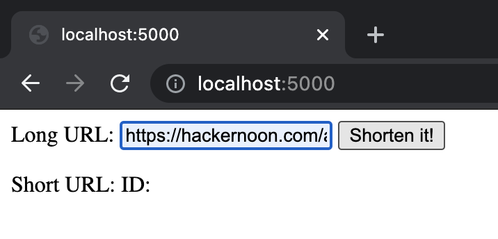

# URL-Shortener
URL shortening repo

#### Steps to use
1. Pull docker image.

    `docker pull mani1604/url_shortener:v1`

2. Create container.

    `docker run --name url -p 5000:5000 url_shortener:v1`

3. Open a browser and type the following and press enter.

    `http://localhost:5000/`
    
    
    
4. Provide the URL that needs to be shortened. Click on 'Shorten it!' button.

    
    

5. You get the shortened URL. Copy paste it in the browser to use it.

    

